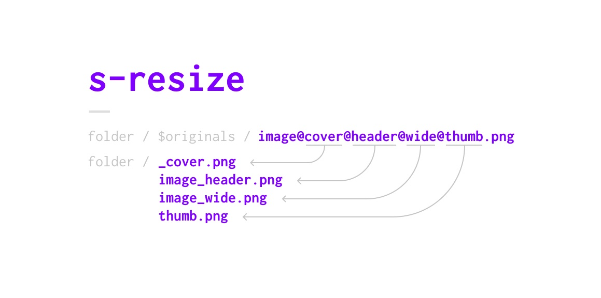

### About
A command line tool (don't worry, it is easy to use), which resizes images. Thanks to custom file names (like *image@thumb@header.png*) you can resize one image to multiple sizes. You don't have to touch Photoshop anymore after exporting into one big image.

In case you run a website **without** a backend that keeps your images crisp, then this is for you. 

**Tip:** Works great with [Kirby](https://getkirby.com).

### Preparations
1. Place high-resolution images in any standard (like *jpg*, *png* **NOT** *Sketch* or *Photoshop*) into a sub-folder called **$originals**. The converted images will be placed in the parent directory and your originals (and any other files) will not be touched.
2. Add custom ending to images for specific sizes (e.g. *myImage@thumb.jpg* for it to be converted to a thumbnail).
3. Customize the specified sizes and naming convention: Open `resize.py` in a text editor and edit sizes and names.
4. Now you are ready for the "How the run"-section

### Example

```
portfolio
├━━ project1
|    ├━━ description.md
|    ├━━ $originals
|         ├━━ image1@header.jpg
|         |━━ image2.jpg
|         |━━ image3@thumb.jpg
├━━ project1
     ├━━ document.md
     ├━━ something.file
     ├━━ $originals
          ├━━ image1@full@zoomable.jpg
          |━━ image2.jpg
```

▲ becomes ▼

```
portfolio
├━━ project1
|    ├━━ description.md
|    ├━━ image1_header.jpg
|    ├━━ image2.jpg
|    ├━━ image3.jpg
|    ├━━ thumb.jpg
|    ├━━ $originals
|         ├━━ image1@header.jpg
|         |━━ image2.jpg
|         |━━ image3@thumb@large.jpg
├━━ project1
     ├━━ document.md
     ├━━ something.file
     ├━━ image1_full.jpg
     ├━━ image1_zoomable.jpg
     ├━━ image2.jpg
     ├━━ $originals
          ├━━ image1@full@zoomable.jpg
          |━━ image2.jpg
```

#### How to run
3. Open `Terminal` on your Mac (or the equivalent on your OS)
4. In Terminal, navigate to the folder you want to iterate through
5. Enter the command `python path/to/resize.py` (you can drag and drop the python file into the terminal to get its path or you just put it where it should be run)
6. Done – all your images are now resized

### Cost (License)
0 € – it's **public domain**